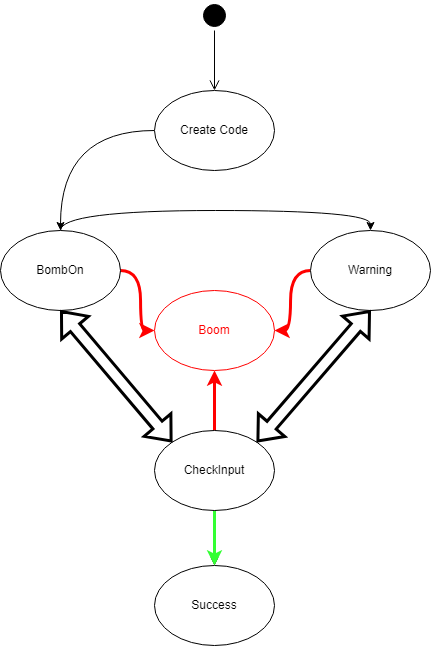
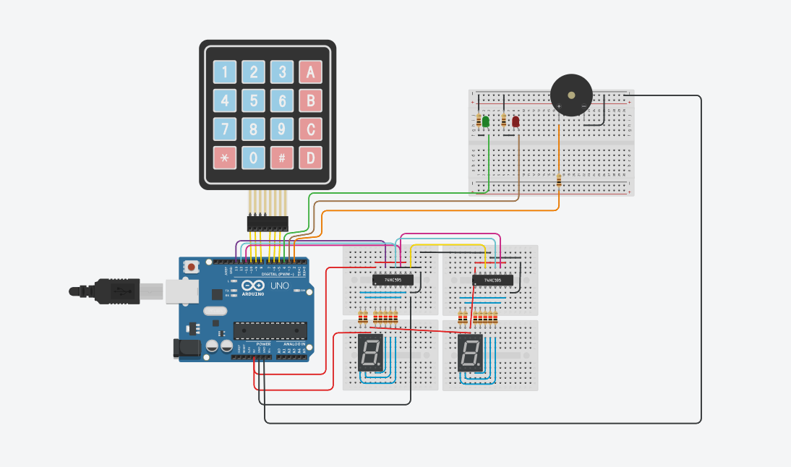

## Les consignes étaient:
### TP Fake Bomb

##### Pour un Escape Game vous devez coder une fausse bombe :

- [x] On lance la bombe
- [x] 2 afficheurs 7 segments affichent le temps restant (en secondes)
- [x] À l'aide d'un pavé numérique il faut trouver le code secret (autogénéré)
- [x] lors des 10 dernières secondes il y a un bip
- [x] La console ou écran LCD vous donne des indices sur le code secret

## Pour répondre à cette problématique, l'équipe est composée de:
- Enzo Parriel
- Louis Senac--Savall

## Nous avons fait une machine à états en voici l'uml:

## Screen branchements électronique:

## Les règles du jeu:
- Une fois la bombe amorcée, vous avez 4 essaies pour trouver 
le bon code en écrivant sur le keypad ou 50 secondes avant que la bombe explose. 
- Au début de la partie un indice vous est donnée dans la console en donnant une intervalle
dans laquelle le code se trouve, sachant que le code ne contient pas le chiffre zéro.
- À chaque erreur, un buzzer retentit et vous perdez 10 secondes aux 50
qui vous sont données au début. Mais en contre partie vous trouverez dans la console un indice qui vous dit si le 
code est supérieur ou inférieur à celui que vous avez rentré.
- Lors des 10 dernières secondes, un buzzer retentit une fois toutes les secondes.
- Le temps sera affiché en secondes à l'aide des afficheurs 7 segments, l'affichage sera à jour une seconde après que la
bombe soit amorcée(à 49 secondes).
- En cas de victoire (vous avez trouvé le bon code), la bombe passera à l'état SUCCESS dans 
la console et une LED verte s'allumera.
- En cas de défaite (soit vous avez échoué 4 fois sur le code, soit le temps s'est écoulé)
un son assez désagréable pour les oreilles (faites attention) retentira et une led rouge va s'allumer.
- Le programme s'arrêtera après l'explosion ou le désamorçage de la bombe.

>### cheatcode : 
>décommenter les lignes 136 et 137 ce qui affichera le code au début de la partie.

### Le lien tinkercad est:
[Tp fake bombe](https://www.tinkercad.com/things/7zCgaP8MNjo-ingenious-blad/editel?sharecode=vep9DsqOOjujX4gSeEuJTFc0ExwxQeOHoXM3gN-1c1A)
